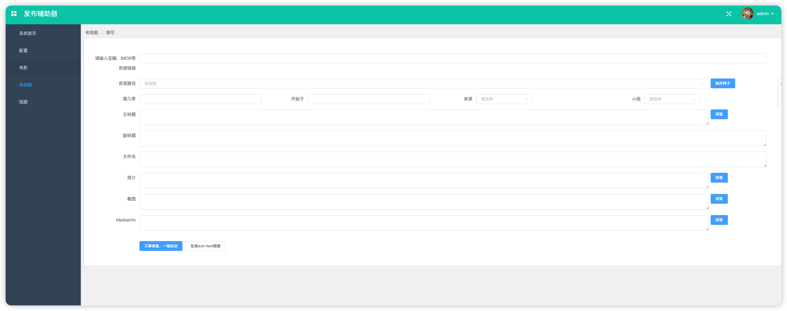

# publish-helper-vue
发布辅助器页面vue实现


# 快速开始

### 依赖安装

```
npm install
```

### 项目启动

```shell
npm run serve
```

### 项目打包

```shell
npm run build
```


提示tips:

> 如果提示openssl编译报错  
> 是因为nodejs版本比较新，执行下面的命令配置环境变量即可

```shell
export NODE_OPTIONS="--openssl-legacy-provider"
```

### 开发进度

| 计划     | 状态 |
|--------|--|
| 照搬gui页面 | ✅ |
| 设置     |  |
| 电视剧 |  |
| 短剧 |  |
| 电影 |  |




